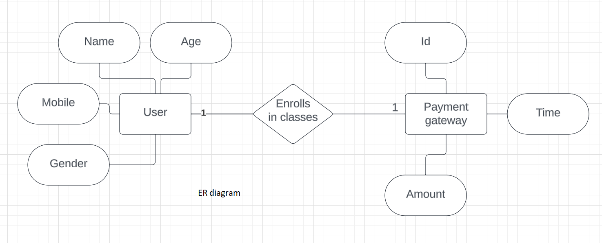

## Register for classes
A Web application for registering the users in new batches of yoga classes.<br/>
Conditions:-
- Only people within the age limit of 18-65 can enroll for the monthly classes and they will
be paying the fees on a month on month basis. I.e. an individual will have to pay the fees
every month and he can pay it any time of the month.
- They can enroll any day but they will have to pay for the entire month. The monthly fee is
500/- Rs INR.
- There are a total of 4 batches a day namely 6-7AM, 7-8AM, 8-9AM and 5-6PM. The
participants can choose any batch in a month and can move to any other batch next
month. I.e. participants can shift from one batch to another in different months but in the
same month they need to be in the same batch.<br/>
To run the code make sure you have nodejs and git installed and
follow the following instructions :-

1.  Open a terminal and clone the repo using -
```
git clone https://github.com/s4marth/Mongo
```
2.  Install the dependencies using - 
```
npm install
```
3.  Finally Run the app using - 
```
npm start
```

## Er diagram<br/>

